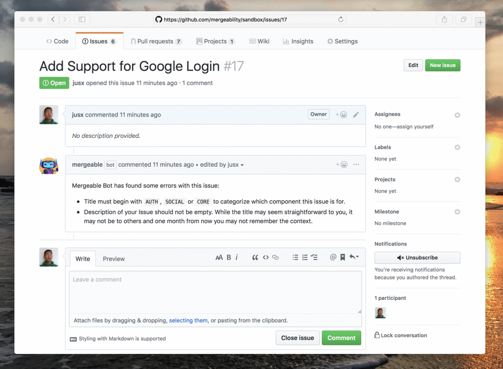

<h1 align="center">
  <br>
  </a>
  <br>
  <p>Mergeable</p>
</h1>

<h4 align="center">A bot that enforces consistency and standards on your GitHub projects and repositories.</h4>

<p align="center">
  <a href="https://github.com/apps/mergeable">
    
  </a>
  <a href="https://circleci.com/gh/jusx/mergeable"></a>
</p>

<p align="center">
  <a href="#key-features">Key Features</a> •
  <a href="#vision">Vision</a> •
  <a href="#configuration">Configuration</a> •
  <a href="#usage">Usage</a> •
  <a href="#contributions">Contributions</a>
</p>




## Key Features

- [Prevent pull requests to be merged](#pull-requests)  based on configured rulesets
- [Notify author of failed guidelines when openning an issue](#issues) based on configured rulesets
- [Detect stale issues and pull requests](#staleness) and notify author and collaborators.

### Pull Requests

Validate pull requests for mergeability based on content and structure of your PR (title, labels, milestone, project, description, approvals, etc). The rule-sets are fully configurable. Here are a few examples of what you can do:

- Prevent accidental merging of Pull Requests that are work in progress by labeling it `wip` or prefixing the title with the abbreviation.

- Ensure all Pull Requests have a description so that when you view through history you still have context.

- Ensure that all Pull Requests are approved by a specific list of users. It is especially useful if one of the users is not a collaborator of your repository -- something GitHub does not already support.

- Ensure that all Pull Requests merged are in a specific GitHub Project. Mergeable even detects when you are closing an issue that is associated with the right project. This is very useful when your process includes QA validation of stories.

- [And more](#configuration).

### Issues

There may be certain formats and structure you want your Github issues to adhere to. Mergeable allows you to configure this and will create a comment with a list of suggested improvements to your Issue.

- Notify the author and collaborators when an issues does not adhere to certain formats in the title.

- Notify when projects and milestones are not associated.

Check the example configuration for [all the available features](#configuration). The Mergeable project is ongoing and there are a lot more that we are working on.

### Staleness

Detect stale issues and pull requests. Notify authors and collaborators by leaving a comment. Staleness is defined through [configuration](#configuration).

## Vision

The Mergeable vision is to make the software development effort efficient so that everyone can focus on building software.  

There are several areas in which we wish to automate for efficiency: consistency, workflow,  quality and statistics. The basic features for these areas are as follows:

### Consistency

- *Pull Request* validation for standards based on configured rulesets. 

- Notify by creating a comment in *Issues* that do not adhere to configured ruleset. 

- Ruleset across Repos. As a way to enforce and encourage standards in an organization or guide team members on the organizations' engineering best practises.

- Repo(s) audit. Scan repo(s) for standards configured in rulesets including existance OWNERS file, or .github contains TEMPLATES. Notify through creation of an issue in the repo(s).

### Workflow

- Kanban WIP limits. Limit the number of open Pull Requests by author.

- Staleness and Reminders: create a comment on any *Issue* or *Pull Request* found to be stale such that the author and collaborators are notified. 

- Projects WIP Limits by column in GitHub Projects.

- Better GitHub Projects automation. i.e. When an issue is assigned, the card automatically moves from column 1 (i.e. `Backlog` if configured as such) to column 2 (i.e. `In Progress` if configured as such) in the kanban board.

- Improved Project Management Integrations (two way): Clubhouse, Pivotal Tracker, Jira, Trello

- Slack Integration.

### Quality

- Detect language and/or testing framework in a repos -- For example: ensure coverage must be greater than 80% or based on config. Suggest testing frameworks if none exists (display configured guideline by creating an issue etc.).
- Suggest (by creating an issue in the repo) testing frameworks if none exists.
- Linting standard. Automatically run linter based on tech stack.
- Security analysis.

### Statistics

- Top contributor across repos.
- Pull Request Merged.
- Number of commits, comments, reviews.
- Leaderboard.

Our longer term vision is to bring this automation to GitLab and BitBucket as well.

## Configuration
Mergeable is fully configurable. Configuration of the rulesets can be done in two ways: Simple or advanced. You can configure mergeable by creating a `.github/mergeable.yml` file in your repository.

Here's an example file for simple settings:

```yml
##############################
# Example Simple Settings
#############################
mergeable:
  pull_requests:
    # Minimum of 5 approvals is needed.
    approvals: 5

    # Regular expression to be tested on the title. Not mergeable when true.  
    title: 'wip'

    # Only mergeable when milestone is as specified below.
    milestone: 'version 1'

    # Only mergeable when Project is as specified below
    project: 'Alpha'

    # exclude any of the mergeable validation above. A comma separated list. For example, the following will exclude validations for approvals and label.
    exclude: 'approvals, label'

  issues:
      # Regular expression. In this example, whenever a issues has a label with the word 'wip'
      label: 'wip|do not merge|experimental'
```

Here's an example configuration file for advanced settings and all of it's possible options:

```yml
  ##############################
  # example Advanced Settings
  ##############################
  mergeable:
    pull_requests:
      stale:
        # number of days for a PR to be considered stale. A comment is posted when it is stale.
        days: 20
        # Optional property. When not specified the default is used. The default message is:
        # There haven't been much activity here. This is stale. Is it still relevant? This is a friendly reminder to please resolve it. :-)
        message: 'This is PR is stale. Please follow up!'
      title:
        must_include:
          regex: `^\\(feat\\)|^\\(doc\\)|^\\(fix\\)`
          message: `Title must have prefixes for the following: (feat), (doc), (fix)`
        must_exclude:
          regex: 'wip'
          message: 'This PR is work in progress.'
        begins_with:
          match: '(feat)|(doc)|(fix)'
          message: 'Custom message...'
        ends_with:
          match: '(feat)|(doc)|(fix)'
          message: 'Custom message...'

      label:
        must_include:
          regex: `^\\(feat\\)|^\\(doc\\)|^\\(fix\\)`
          message: `Title must have prefixes for the following: (feat), (doc), (fix)`
        must_exclude:
          regex: 'wip'
          message: 'Custom message. This PR is work in progress.'
        begins_with:
          match: '(feat)|(doc)|(fix)'
          message: 'Come message...'
        ends_with:
          match: '(feat)|(doc)|(fix)'
          message: 'Come message...'  

      milestone:
        must_include:
          regex: `Release 1`
          message: `Custom message...`
        must_exclude:
          regex: 'jibberish'
          message: 'Custom message...'
        begins_with:
          match: 'Release'
          message: 'Custom message...'
        ends_with:
          match: ''
          message: 'Custom message...'

      project:
        must_include:
          regex: `Release 1`
          message: `Custom message...`
        must_exclude:
          regex: 'jibberish'
          message: 'Custom message...'
        begins_with:
          match: 'Release'
          message: 'Custom message...'
        ends_with:
          match: ''
          message: 'Custom message...'  

      approvals:
        min: 5
          message: 'Custom message...'
        required:
          reviewers: [ user1, user2 ]   # list of github usernames required to review
          owners: true | false # will read the file .github/CODEOWNER and make them required reviewers
          message: 'Custom message...'		

      description:
        no_empty:
          enabled: false
          message: 'Custom message...'
        must_include:
          regex: 'feat'
          message: 'Custom message...'
        must_exclude:
          regex: 'DO NOT MERGE'
          message: 'Custom message...'

      assignee:
        min: 1
        max: 1
        message: 'Custom message...'

    #####
    #  Advanced settings for issues. When any of the rules  below is not valid Mergeable will create a comment on that issue to let the author know.    
    ###
    issues:
      stale:
        # number of days for an issue to be considered stale. A comment is posted when it is stale.  
        days: 20
        # Optional property. When not specified the default is used. The default message is used.
        message: 'This is issue is stale. Please follow up!'
      title:
        must_include:
          regex: `^\\(feat\\)|^\\(doc\\)|^\\(fix\\)`
          message: `Title must have prefixes for the following: (feat), (doc), (fix)`
        must_exclude:
          regex: 'wip'
          message: 'This PR is work in progress.'
        begins_with:
          match: '(feat)|(doc)|(fix)'
          message: 'Custom message...'
        ends_with:
          match: '(feat)|(doc)|(fix)'
          message: 'Custom message...'

      label:
        must_include:
          regex: `^\\(feat\\)|^\\(doc\\)|^\\(fix\\)`
          message: `Title must have prefixes for the following: (feat), (doc), (fix)`
        must_exclude:
          regex: 'wip'
          message: 'Custom message. This PR is work in progress.'
        begins_with:
          match: '(feat)|(doc)|(fix)'
          message: 'Come message...'
        ends_with:
          match: '(feat)|(doc)|(fix)'
          message: 'Come message...'  

      milestone:
        must_include:
          regex: `Release 1`
          message: `Custom message...`
        must_exclude:
          regex: 'jibberish'
          message: 'Custom message...'
        begins_with:
          match: 'Release'
          message: 'Custom message...'
        ends_with:
          match: ''
          message: 'Custom message...'  

      project:
        must_include:
          regex: `Release 1`
          message: `Custom message...`
        must_exclude:
          regex: 'jibberish'
          message: 'Custom message...'
        begins_with:
          match: 'Release'
          message: 'Custom message...'
        ends_with:
          match: ''
          message: 'Custom message...'

      description:
        no_empty:
          enabled: false
          message: 'Custom message...'
        must_include:
          regex: 'feat'
          message: 'Custom message...'
        must_exclude:
          regex: 'DO NOT MERGE'
          message: 'Custom message...'

      assignee:
        min: 1
        max: 1
        message: 'Custom message...'
```

By default if the configuration file does not exist, the following is the default settings out of the box:

```yml
  ####################
  # default settings
  ####################
  mergeable:
    pull_requests:
      label: 'work in progress|do not merge|experimental|proof of concept'
      title: 'wip|dnm|exp|poc'
      description:
        no-empty: true
```
The configuration file follows a certain format. It is in the general following structure:

```yml
mergeable:
  subject:
    topic:
      advanced_option (optional):
```

### Structure & Formating
The configuration file in general follows a structure. There is a hierarchy of `subject`, `topic`, and `advanced_option`.

Currently the list of `subjects` available are:
- pull_requests:
- issues:

A list of `topics` available for a simple configuration file are as follows:
- title: regex (must exlude)
- description: regex (must exclude)
- assignee: number (minimum number of assignees)
- labels: regex (must exclude)
- milestone: regex (must include)
- project: regex (must include)
- approvals: number (minimum number of assignee)
- exclude: [] (exclude any of the topic above)

A list of `advanced_option` for an advanced configuration file are as follows:
- must_include
   - regex
   - message
- must_exclude
   - regex
   - message
- begins_with
   - match
   - message
- ends_with
   - match
   - message
- min
   - count
   - message
- max
   - count
   - message
- no-empty
   - enabled
   - message
- required
   - reviewers
   - message

**Note**: Not all `advanced_option` works with all topics and `sub_options` must be provided for each advanced options.


## Usage

### Install the app
1. [Install](https://github.com/apps/mergeable) the Mergeable GitHub App.
2. [Configure](#configuration) Mergeable or do nothing else and just go with the default.
3. Ensure branch is protected and [Require status checks to pass before merging](https://help.github.com/articles/enabling-required-status-checks/) is checked.

### Deploy your own

If you would like to run your own instance of this plugin, you can do so by forking this repo and deploying it to your own servers or run it locally.

[Create a GitHub App](https://github.com/settings/apps/new) and configure the permissions & events with the following:

**Settings:**
- GitHub app name - **Your app name**
- Webhook URL - **Your webhook url for listening to events** (local deployments you can use [smee.io](smee.io))
- Webhook secret - **Your generated webhook seceret**

**Permissions:**
- Checks - **Read & Write**
- Issues - **Read & Write**
- Repository metadata - **Read Only**
- Pull requests - **Read Only**
- Commit Statuses - **Read & Write**
- Single File - **Read-only**
  - Path: `.github/mergeable.yml`

**And subscription to the following events:**
- [x] Pull request
- [x] Pull request review comment
- [x] Pull request review
- [x] Issues

### Running Locally
1. Clone the forked repository on to your machine
2. Globally install smee-client from with npm ```npm install -g smee-client```
3. Export all the variables required based on the ProBot deployment guide above
4. Run smee in your terminal by using the ```smee``` command
5. Run npm start in your local repository
6. Add a repository for your Github app by going to [application settings](https://github.com/settings/installations)
7. Do a test pull request to check if everything is working

## Contributions
 [Contribute](https://github.com/jusx/mergeable/blob/master/CONTRIBUTING.md) by creating a pull request or create a [new issue](https://github.com/jusx/mergeable/issues) to request for features.
